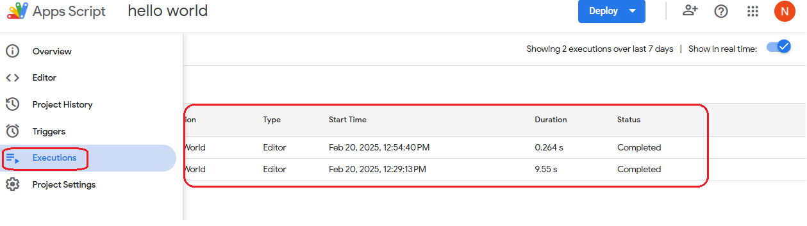

<h1>Project Name</h1>
<p>Introduction to Google Apps Script</p>

<h2>Project Description</h2>
<p>A simple Google Apps Script project with a function that prints 'Hello, World!' to the console on demand and via a timer.</p>

<h2>Motivation</h2>
<p>
    I needed a reliable way to keep my inbox fresh by moving emails older than 24 hours to a separate folder. Initially, I used a Digital Ocean droplet, Gmail API, and authentication to handle this task, and it worked for a few years. 
    However, I recently faced issues when updating to newer versions of Node.js and TypeScript. Google Apps Script seems like a suitable alternative to accomplish this task seamlessly, but first, I need to explore this technology.
</p>

<h2>Installation</h2>
<p>No installation is required, but you do need a Gmail account.</p>

<h2>Usage</h2>
<p>Follow these steps:</p>
<ul>
    <li>Create a new project.</li>
    <li>Add a function.</li>
    <li>Run the function.</li>
    <li>Add a trigger.</li>
    <li>Run the function using the trigger.</li>
</ul>
<p>See the <strong>Demo</strong> section below for detailed steps.</p>

<h2>Code Structure</h2>
<p>The following function logs "Hello, World!" to the console:</p>

```js
function helloWorld() {
Logger.log("Hello, World!");
}
```

<h2>Demo</h2>

<h3>Dashboard Screen</h3>
<p>Go to <a href="https://script.google.com" target="_blank">Google Apps Script Dashboard</a>. You'll see 'My Projects' and 'My Triggers' highlighted in red.</p>


<h3>Create a New Project</h3>
<p>Click on the 'New project' button as shown below:</p>


<h3>Created Project</h3>
<p>The <code>helloWorld</code> function (circled in red) was added to the new project. Click the 'Run' button (circled in red) to execute it and check the result in the 'Execution log'.</p>


<h3>Add a Trigger</h3>
<p>In your 'Hello World' project, navigate to the 'Triggers' section, select your parameters, and click 'Add trigger'.</p>


<p>You can later edit the trigger parameters:</p>


<h3>Executions</h3>
<p>View all function executions from the project dashboard by clicking on 'Executions':</p>


<p>After the time-driven trigger runs, you'll see this:</p>


<h2>Points of Interest</h2>
<ul>
    <li><a href="https://www.npmjs.com/package/@google/clasp" target="_blank">Clasp</a> – A command-line tool for Google Apps Script.</li>
    <li>A Google account is required. If you're using a Google Workspace account, you’ll have additional benefits, such as increased quotas.</li>
</ul>

<h2>References</h2>
<ul>
    <li><a href="https://developers.google.com/apps-script" target="_blank">Google Apps Script Documentation</a></li>
</ul>

